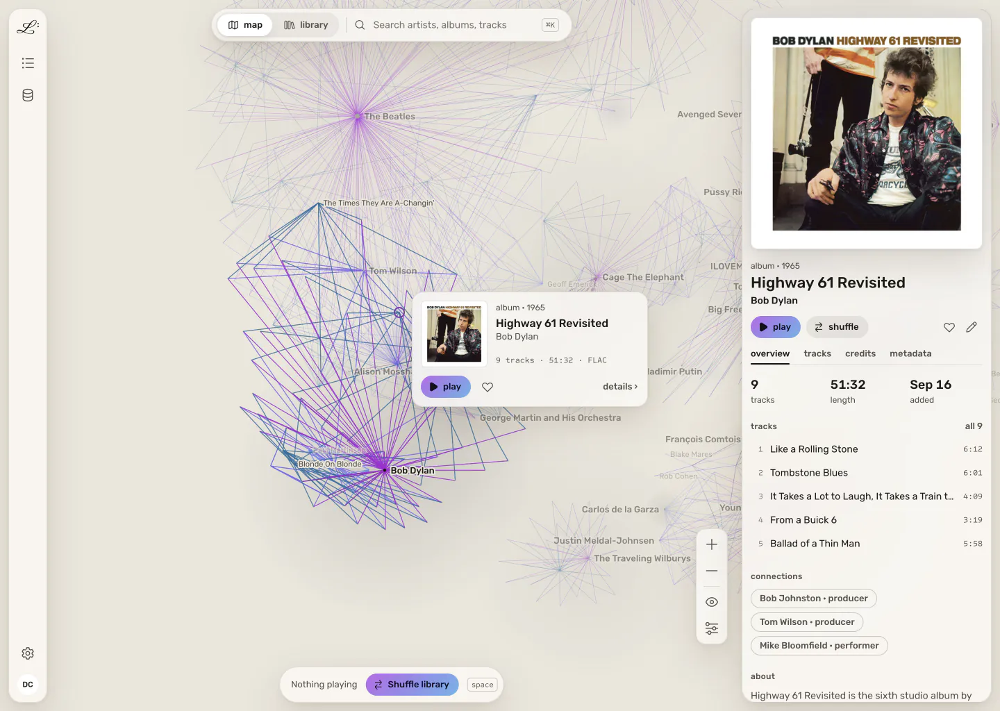

# Legato

**Your music library as a graph.** Legato is a local-first music player and library manager. Every recording, artist, album and label gets its own article, linked to the rest of what you own. You browse by association: open a track and find out its engineer worked on three other records you have.

<picture>
  <source media="(prefers-color-scheme: dark)" srcset="site/public/images/hero-dark-1440.webp" />
  
</picture>

> **Status: pre-release.** Legato runs today against real libraries, but there are no public builds yet. The install options below are ready in the repo and will be published with the first release. [legato.fm](https://legato.fm) has the waitlist.

## What it does

- **The map.** A live, force-directed graph of your library. Recordings, artists, releases, labels and producers sit where their connections pull them.
- **Articles.** Each node opens a page built from your tags and open sources such as MusicBrainz, Cover Art Archive and Wikipedia, with every release, recording and credit a link.
- **A plain library when you want one.** An album grid and a track table that stay fast at tens of thousands of albums, sharing one search and selection with the map.
- **Library health.** It flags missing and conflicting tags, and fixes them in place. Tag write-back is FLAC only for now.
- **Gapless native playback** on the desktop. Browsers and phones stream from your server, at a quality picked for the connection.

## Free, and what's paid

Everything you run yourself is free: the desktop app, the server, the web client, every feature. You don't need an account.

The one paid product, once it launches, is **Legato Relay**: an always-on bridge so your phone can reach your home library from anywhere, with no port forwarding and no VPN to set up. It passes your audio through and doesn't store it. The relay's code is in this repo too ([`relay/`](relay)), so you can read exactly what it does, or run your own.

## Ways to run it

| | Guide |
|---|---|
| Docker / Docker Compose | [docs/install/docker.md](docs/install/docker.md) |
| Synology (Container Manager) | [docs/install/synology.md](docs/install/synology.md) |
| Unraid | [packaging/unraid](packaging/unraid) |
| Linux, with a one-line install script and a systemd user service | `curl -fsSL https://legato.fm/install.sh \| sh`, available after the first release |
| macOS, with Homebrew | [packaging/homebrew](packaging/homebrew), available after the first release |
| Desktop app (macOS, Windows, Linux) | Signed builds are on the way. Until then, [build from source](#building-from-source) |

On first start, a headless server shows a short setup code. Open `http://<your server>:8899/setup` on your home network to create the owner account, then add your music folder.

## Privacy

Your music, its metadata, your playlists and your play history stay on your own hardware. To fill in details, your server looks things up directly in MusicBrainz, the Cover Art Archive, LRCLIB, Deezer and Wikipedia/Wikidata. It also checks GitHub once a day for a new release; you can turn that off. Nothing about your library is sent to us. The full details are at [legato.fm/privacy](https://legato.fm/privacy).

## Building from source

You need Node (the version in [`.nvmrc`](.nvmrc)), [Bun 1.4.2](https://bun.sh) and a Rust toolchain.

```sh
nvm use
npm install
npm --prefix server install
npx tauri dev          # the full desktop app; it starts its own server
```

`npm run check:all` runs every test and check. [docs/development.md](docs/development.md) covers running the server and web client on their own, previewing from another machine, and troubleshooting. [AGENTS.md](AGENTS.md) has the conventions and the non-obvious parts of the codebase, and [DESIGN.md](DESIGN.md) the visual language.

## Contributing

Issues and pull requests are welcome. Read [CONTRIBUTING.md](CONTRIBUTING.md) first. Contributions need a signed [Contributor License Agreement](CLA.md). Report security problems privately, as described in [SECURITY.md](SECURITY.md).

## License

Copyright © 2026 Daniel Churchill.

Legato is free software, licensed under the [GNU Affero General Public License v3.0](LICENSE) (AGPL-3.0-only). You can use, study, change and share it. If you run a modified version as a network service, you must offer its users the source of your version. Third-party components keep their own licences; see [THIRD_PARTY_NOTICES.md](THIRD_PARTY_NOTICES.md).

The Legato name, logo and the legato.fm domain are not covered by the licence. See [TRADEMARKS.md](TRADEMARKS.md).
